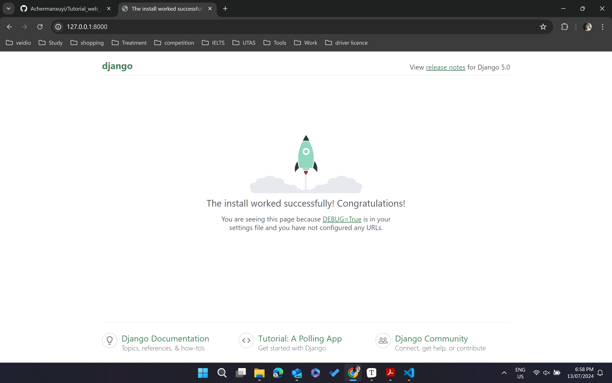
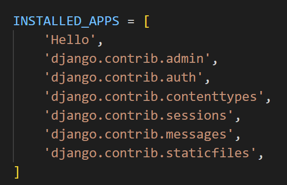
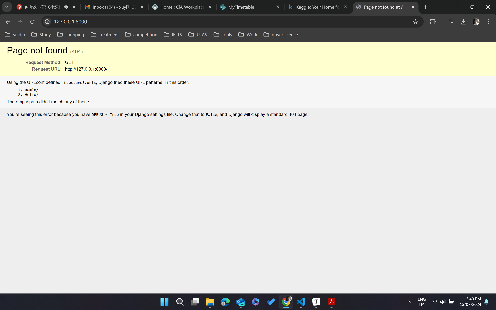
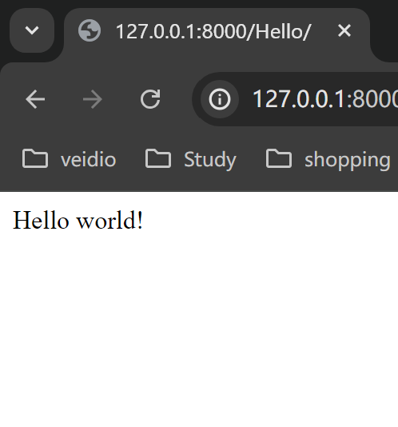
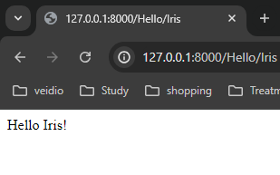
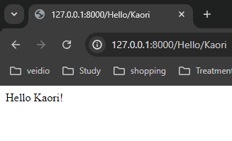
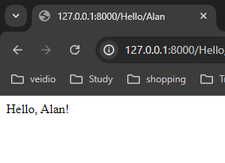
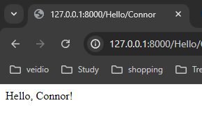
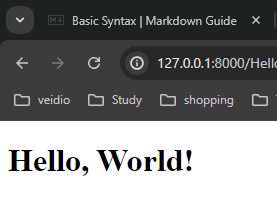

# Tutorial_web_programming
**Course: Web Programming with Python and JavaScript**
*This is the note of  the course "Web Programming with JavaScript and Python"*
+ IDE: VS code (extensions required)
+ Language: HTML, css, scss, JavaScript, Python

## Git

### git clone

```
git clone <url>
```

**Download the repository to the local computer.**


In vs code terminal, 

```powershell
code filename.extension
```

to create a new file in current project folder.

eg.

```powershell
code hello.html
```

Then a file called "hello.html" is created successfully.

### git add

```powershell
git add <filename>
```

Track the file, so this file and the changes being made will be saved next time.

```powershell
git add .
```

Track all files within the directory.

### git commit

```powershell
git commit -m "message"
```

Save the current state of files.

"message": descriptions of changes you've made in the most recent commit files.

If you commit all of the file that have been changed at the same time, use:

```powershell
git commit -am "message"
```

### git status

```powershell
git status
```

Report current repository status.

### git push

```powershell
git push
```

Publish your local commits to github.

### git pull

```
git pull
```

Sometimes, the remote repository on GitHub will be more up to date than the local version. In this cade, you want to first commit any changes then run `git pull` to pull any remote changes to your local repository.

### Merge Conflicts

+ One problem that can emerge when working with Git, especially when you're collaborating with other people, is something called a **merge conflict**. A merge conflict occurs when two people attempt to change a file in ways that conflict with each other.
+ This will typically occur when you either `git push` or `git pull`. When this happens, Git automatically change into a format that clearly outlines what the conflict is. 

The IDE will show the changes and their authors, you can choose the version you want or directly change the repository.

### git log

```powershell
git log
```

Give a history of all of your commits on that repository.

*To exit: press `Q` key*.

### git reset

Revert back to a previous commit.

```powershell
git reset --hard <commit>
git reset --hard origin/master
```

+ commit: revert your code to a exact version with commit hash code (seen in `git log`).

+ origin/master: revert your code to the version currently stored online on Github.

### Branching

+ Branching is a method of moving into a new direction when creating a new feature, and only combining this new feature with the main part of your code, or the main branch.

+ The branch you are currently looking at is determined by the `HEAD`, which points to one of the two branches. Nu default, the HEAD is pointed at the master branch, but we can check out other branches as well.

+ How to implement branching in our git repositories:

  + Run `git branch` to see which you are currently working on:
    ```powershell
    PS E:\Full Stack\Web Programming with Python and JavaScript\Code\Tutorial_web_programming> git branch
    * main
    ```

  + To make a new branch

    ```powershell
    git checkout -b <branch name>
    ```

  + Switch between branches.

    ```powershell
    git checkout <branch name>
    ```

    And commit any changes to each branch.

  + when we are ready to merge our branches together, we'll check out the branch we wish to keep (almost always the master branch).

    ```powershell
    git merge <othter branch name>
    ```

## Python

Go other Python tutorials.

## Django

+ So far all of the web applications we've written have been **static**. This means that every single time we open that web page, it looks exactly the same. Many website we visit every day, however, change every time we visit them, which is where **dynamic** websites can be extremely useful.
+ In this chapter, we'll work on using Python's `Dango` framework in order to create dynamic applications.

### Django

Django (https://www.djangoproject.com/) is a Python-based web framework that will allow us to write Python code that dynamically generates HTML and CSS. The advantage to using a frame work like Django is that a lot of code is already written for us that we can take advantage of.

I use anaconda to manage my virtual environments. I installed `Django` in my `base` environment. 

```powershell
-conda activate base
-pip install Django
```

After installing Django, we can go through the steps of creating a new Django project:

1. Run `django-admin startproject PROJECT_NAME` to create a number start files for our project.
2. Run `cd PROJECT_NAME` to navigate into your project's directory.
3. Open the directory in your IDE, you'll notice some files have been created for you. There are 3 that will be very important from the start:
   + `manage.py` is what we use to execute commands on out terminal. We won't have to edit it, but we will use it often.
   + `settings.py` contains some important configuration settings for our new project. There are some default settings, but we may wish to change some of them from time to time.
   + `urls.py` contains directions for where users should be routed after navigating to a certain URL.
4. Start the project by running `python manage.py runserver`.  This will open a development server, which you can access by visiting URL provided. This development server is being run locally on your machine, meaning other people cannot access your website.

```powershell
python manage.py runserver
```

*Default landing page:*




5. **Create applications. ** Django projects are split into one or more **applications**. To create an application, run `python manage.py startapp APP_NAME`. This will create some additional directories and files that will be useful shortly, including `views.py`.
6. To install the new app, go to `settings.py`, find `INSTALLED_APPS`, and add the name of the new application to this list.

​	


### Routes

**Start applications**

1. Navigate to `views.py`. This file will contain a number of different views, and a view  can be thought as one page the users might like to see. To create a view, we'll write a function that takes in a `request`. The function  index simply returns an `HttpResponse` (A very simple response that includes a response code of 200 and string of text that can be displayed in a web browser) if " Hello world!". In order to do this, relevant modules is imported. 	

```python
from django.http import HttpResponse
from django.shortcuts import render

# Create your views here.
def index(request):
    return HttpResponse("Hello world!")

```

2. To associate this view we just created with a specific URL. Create another file called `urls.py` in the same directory as `views.py`. For each individual app, it's best to have a separate `urls.py`.
3. Inside the new `urls.py`,  a new list of url patterns will be created that a user might visit while visit while using the website. In order to do this:
   1. Import modules: `from django.urls import path`.
   2. Create a list called `urlpatterns`.
   3. For each desired URL, add an item to the `urlpatterns` list that contains a call to the `path` function with two or three arguments: A String representing the URL path, a function from `views.py` being called, and a name for that path (optional).
   
   ```python
   from django.urls import path
   from . import views
   
   urlpatterns =[
       path("", views.index, name="index")
   ]
   ```
   
   4. Edit the `urls.py` created for the entire project. A path `admin` is already there, we need add another path for the new app, so we'll add an item to the `urlpatterns` list following the same pattern as the earlier paths. To include **all ** of the paths from the `urls.py`, write `include(APP_NAME.urls)`.
   
   ```python
   from django.contrib import admin
   from django.urls import include, path
   
   urlpatterns = [
       path('admin/', admin.site.urls),
       path('Hello/', include("Hello.urls"))
   ]
   ```
   
   5. By doing this, we’ve specified that when a user visits our site, and then in the search bar adds `/hello` to the URL, they’ll be redirected to the paths inside of our new application.

Now, using `python manage.py runserver` and visit the url provided.



The screen is shown above, because I have only defined the URL `localhost:8000/Hello`, but we haven't defined the URL `localhost:8000`. So when adding `/Hello` to the URL in the search bar.



The process got us to that page above.

1. When we access URL `localhost:8000/Hello/`, Django looked at what came after the base URL (`localhost:8000/`) and went to the project's `urls.py` file and searched for a pattern that matched `Hello`.
2. It found that extension because it is defined, and saw that when met that extension, it should `include` the `urls.py` file from within the new application.

```python
from django.contrib import admin
from django.urls import include, path

urlpatterns = [
    path('admin/', admin.site.urls),
    path('Hello/', include("Hello.urls"))
]
```

3. Then Django ignored the parts of the URL it has already used in rerouting (`localhost:8000/Hello/`, or all of it) and looked inside other `urls.py` file for a pattern that matches he remaining part of the URL.
4. It found that the only path so far (`""`) matched what was left of the URL, and so it directed us to the function from `views.py` associated with that path.
5. Finally, Django ran that function within `views.py`, and return the result (`HttpResponse("Hello world!")`) to the web browser.


**Add more than one view to the application.** We can follow many of the same steps within the application to create pages that say hello to Iris and Kaori.

Inside `views.py`

```python
from django.http import HttpResponse
from django.shortcuts import render

# Create your views here.
def index(request):
    return HttpResponse("Hello world!")

def Iris(request):
    return HttpResponse("Hello Iris!")

def Kaori(request):
    return HttpResponse("Hello Kaori!")
```

Inside `urls.py` (within the application)

```python
from django.urls import path
from . import views

urlpatterns =[
    path("", views.index, name="index"),
    path("Iris", views.Iris, name="Iris"),
    path("Kaori", views.Kaori, name="Kaori")
]
```

Now, our page remained unchanged when we visit `localhost:8000/Hello`, but we get different pages when we add `Iris` or `Kaori` to the URL:





Many sites are parameterized by items included in the URL. For example, you can find your own public Github repositories by navigating to `www.github.com.YOUR_USERNAME`.

A general 'greet' function, in`views.py`:

```python
def greet(request, name):
    return HttpResponse(f"Hello, {name}!")
```

This function takes in not only a request, but also additional argument of a user's name, and then returns a custom HTTP Response based on that name. Next, create a flexible path in `urls.py`

```python
path("<str:name>", views.greet, name="greet")
```





This is a great illustration of how any functionality we have in Python can be used in Django before being returned.

### Templates

So far, our HTTP Responses, have been only text, but we can include any HTML elements we want to! For example, I could decide to return a blue header instead of just the text in our `index` function:

```python
def index(request):
    return HttpResponse("<h1 style=\"color:blue\">Hello, world!</h1>")
```


It will get very tedious to write an entire HTML page within `views.py`. It would also constitute bad design, as we want to keep separate parts of the project in separate files.

[Django's templates](https://docs.djangoproject.com/en/4.0/topics/templates/) can keep separate parts of the project in separate files, which will allow us to write HTML and CSS in separate files and render those files using Django. The syntax we'll use for rendering a template looks like this:

```python
def index(request):
    return render(request, "Hello/index.html")
```

Create the template: create a folder called `templates` inside the app folder, then create a folder called `Hello` (or what ever the app's name is) within that, and then add a file called `index.html`.


Next, add content to the `index.html` file

```html
<!DOCTYPE html>
<html lang="en">
  <head>
    <title>Hello</title>
  </head>
  <body>
    <h1>Hello, World!</h1>
  </body>
</html>

```

Search the URL in web browser:

